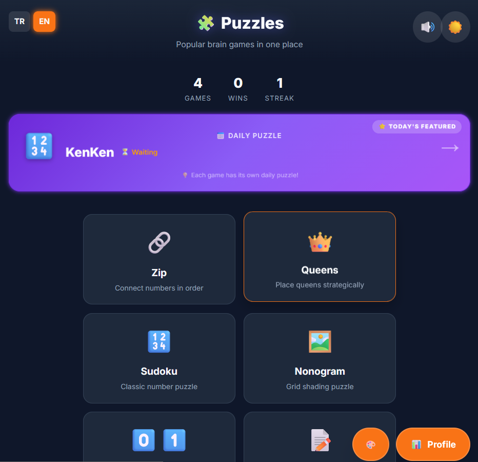

# Bulmaca Super App


<p align="center">
  
</p>

An all-in-one puzzle game collection featuring 15+ classic logic and brain games. Built with modern web technologies, offline-first architecture, and a daily puzzle system.

## 🎮 Games Collection

- **Puzzle:** Zip, 2048, Sudoku, Nonogram, Binary, Kakuro, KenKen, Futoshiki, Queens.
- **Logic:** Lights Out, Mastermind, Flood It, Minesweeper.
- **Memory:** Card Match.
- **Word:** Wordle.

## ✨ Key Features

- **Daily Puzzle System:** A unique, deterministic daily puzzle for every game mode, synced across devices without a server.
- **Offline-First:** Fully functional without an internet connection (ideal for PWA distribution).
- **Dark Mode:** System-aware dark/light theme with multiple accent color options.
- **Internationalization:** Full support for Turkish (TR) and English (EN).
- **Responsive Design:** Optimized for both desktop and mobile touch interfaces.
- **Progress Tracking:** LocalStorage-based stats, streaks, and achievements.

## 🛠️ Technology Stack

- **Core:** HTML5, CSS3, Vanilla JavaScript (ES6+).
- **Styling:** Custom CSS + Tailwind CSS (via CDN).
- **State Management:** LocalStorage.
- **Audio:** Custom `SoundManager` using Web Audio API.

## 🚀 Getting Started

1. **Clone the repository:**
   ```bash
   git clone https://github.com/Batuhania/puzzles-super-app.git
   ```

2. **Run locally:**
   Simply open `index.html` in any modern web browser. No build step or server required.

   *Recommendation:* Use VS Code "Live Server" extension for the best development experience.

## 📝 License

Copyright (c) 2026 Batuhan. All Rights Reserved.
Unauthorized use, modification, or distribution is strictly prohibited.

---

*Verified locally on Chrome, Firefox, and Safari.*


